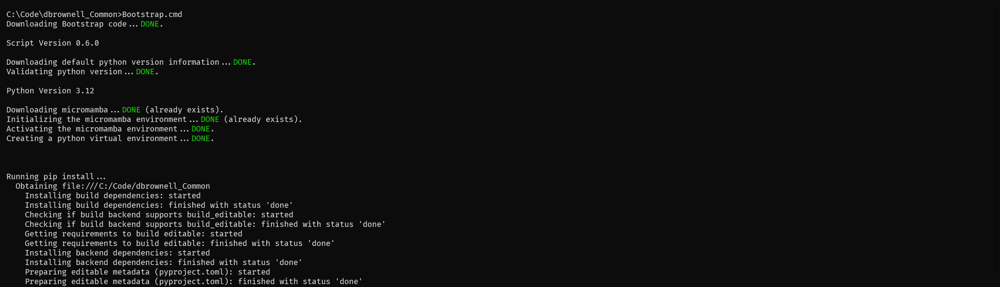
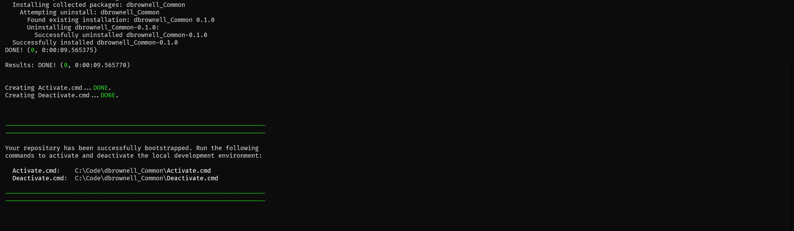
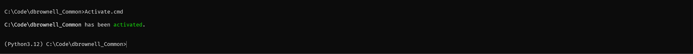
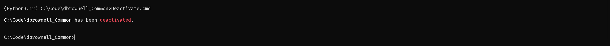

# PythonBootstrapper

<!-- BEGIN: Exclude Package -->
<!-- [BEGIN] Badges -->
[](https://github.com/davidbrownell/PythonBootstrapper/blob/master/LICENSE.txt)
[](https://github.com/davidbrownell/PythonBootstrapper/commits/main/)
<!-- [END] Badges -->
<!-- END: Exclude Package -->

This repository includes tools and scripts that install python locally in as consistent and benign as way as possible. Supports side-by-side installations for different versions of python and minimizes overhead through the use of virtual environments.

<!-- BEGIN: Exclude Package -->
## Contents
- [Overview](#overview)
- [Installation](#installation)
- [Development](#development)
- [Additional Information](#additional-information)
- [License](#license)
<!-- END: Exclude Package -->

## Overview

### Features
#### The bootstrapping process

1) Ensures that [micromamba](https://mamba.readthedocs.io/en/latest/) is available locally.
2) Ensures that [Python](https://python.org) is available locally.
3) Ensures that [virtualenv](https://virtualenv.pypa.io/en/latest/) is installed.
4) Creates a [python virtual environment](https://docs.python.org/3/tutorial/venv.html) for your cloned repository.
5) Creates [Activate](#activate) and [Decativate](#deactivate) scripts for your cloned repository.
6) Invokes custom bootstrapping functionality defined in your repository.



...details removed...



#### The activation process

1) Activates [micromamba](https://mamba.readthedocs.io/en/latest/).
2) Activates the [python virtual environment](https://docs.python.org/3/tutorial/venv.html).
3) Invokes custom activation functionality defined in your repository.



#### The deactivation process

1) Invokes custom deactivation functionality defined in your repository.
2) Deactivates the [python virtual environment](https://docs.python.org/3/tutorial/venv.html).
3) Deactivates [micromamba](https://mamba.readthedocs.io/en/latest/).



#### Testing

All changes to this repository are validated [GitHub runners](https://docs.github.com/en/actions/using-github-hosted-runners/about-github-hosted-runners/about-github-hosted-runners#supported-runners-and-hardware-resources) across the [MacOS](https://www.apple.com/macos), [Ubuntu](https://ubuntu.com/), and [Windows](https://www.microsoft.com/en-us/windows) operating systems using the [Python versions](https://www.python.org/downloads/):

| Python Version | First Released | End of Support |
| --- | --- | --- |
| 3.12 | October 2023 | October 2028 |
| 3.11 | October 2022 | October 2027 |
| 3.10 | October 2021 | October 2026 |
| 3.9 | October 2020 | October 2025 |
| 3.8 | October 2019 | October 2024 |

### How to use PythonBootstrapper
To begin using a git repository leveraging PythonBootstrapper functionality, run the scripts defined here in the following sections.

#### Quick Start

| Operating System | Scripts |
| --- | --- |
| Linux / MacOS | `./Bootstrap.sh`<br/>`. ./Activate.sh`<br/>`. ./Deactivate.sh` |
| Windows | `Bootstrap.cmd`<br/>`Activate.cmd`<br/>`Deactivate.cmd` |

#### Bootstrap

The bootstrap process prepares your local machine for development activities. Once the process is complete, your local machine will have `micromamba` and `python` installed, a virtual python environment created under the `./Generated` directory, and any custom bootstrap activities defined by the repository will have been run.

A repository will generally only need to be bootstrapped once after its is cloned.

| Operating System | Script |
| --- | --- |
| Linux / MacOS | `Bootstrap.sh [--python-version <version>] [--force] [--debug] [<any repository-specific arguments>]` |
| Windows | `Bootstrap.cmd [--python-version <version>] [--force] [--debug] [<any repository-specific arguments>]` |

#### Activate

The activation process prepares your local terminal environment for development activities. Once the process is complete, your terminal environment will have `micromamba` and `python` activated, and any custom activation activities defined by the repository will have been run.

Each terminal environment will need to be activated.

| Operating System | Script |
| --- | --- |
| Linux / MacOS | `Activate.sh [--verbose] [--debug] [<any repository-specific arguments>]` |
| Windows | `Activate.cmd [--verbose] [--debug] [<any repository-specific arguments>]` |

#### Deactivate

The deactivation process restores your local terminal environment to its state prior to activation. Once the process is complete, any custom deactivation activities defined by the repository will have been run, and your terminal will have `micromamba` and `python` deactivated.

A terminal environment can either be explicitly deactivated or simply closed.

| Operating System | Script |
| --- | --- |
| Linux / MacOS | `Deactivate.sh [--verbose] [--debug] [<any repository-specific arguments>]` |
| Windows | `Deactivate.cmd [--verbose] [--debug] [<any repository-specific arguments>]` |

<!-- BEGIN: Exclude Package -->
## Installation
<!-- [BEGIN] Installation -->
### Creating a PythonBootstrapper Repository

Any repository can leverage the functionality provided by PythonBootstrapper, including the creation of custom steps invoked during the [bootstrap](#bootstrap), [activation](#activate), or [deactivation](#deactivate) processes.

#### Minimum Functionality

To use PythonBootstrapper functionality in your repository:

1) Copy `./Templates/Bootstrap.sh` to the root of your repository (for Linux / MacOS support).
2) Copy `./Templates/Bootstrap.cmd` to the root of your repository (for Windows support).
3) Copy `./Templates/.gitignore` to the root of your repository (for git support).

Complete the steps in the following sections to customize the [bootstrap](#bootstrap), [activation](#activate), or [deactivation](#deactivate) processes.

#### Customization

There are 2 ways to customize the [bootstrap](#bootstrap), [activation](#activate), or [deactivation](#deactivate) processes:

1) Add operating-system-specific functionality to `<Bootstrap|Activate|Deactivate>Epilog<.sh|.cmd>`.
2) Implement custom functionality in `<Bootstrap|Activate|Deactivate>Epilog.py`.

Examples for each of these methods for each event can be found in the files:

- `./Templates/BootstrapEpilog.sh`
- `./Templates/BootstrapEpilog.cmd`
- `./Templates/BootstrapEpilog.py`
- `./Templates/ActivateEpilog.sh`
- `./Templates/ActivateEpilog.cmd`
- `./Templates/ActivateEpilog.py`
- `./Templates/DeactivateEpilog.sh`
- `./Templates/DeactivateEpilog.cmd`
- `./Templates/DeactivateEpilog.py`

The events to customize and the means by which they are customized are based on the needs of your repository and the operating systems that it supports.

##### Notes on Customization via Python Files

- Python files are invoked within an activated environment.
- Python files may optionally write operating-system-specific functionality to a temporary file whose name is provided as the first argument when invoking the python script. These instructions are invoked within the current terminal environment once the python script is complete.

##### Bootstrap Examples

The following examples all use pip to install requirements defined in a `requirements.txt` file.

**`BootstrapEpilog.sh`**
```bash
#!/usr/bin/env bash
pip install -r requirements.txt
```

**`BootstrapEpilog.cmd`**
```batch
pip install -r requirements.txt
```

**`BootstrapEpilog.py`**
```python
import os
os.system("pip install -r requirements.txt")
```
<!-- [END] Installation -->

## Development
<!-- [BEGIN] Development -->
Please visit [Contributing](https://github.com/davidbrownell/PythonBootstrapper/blob/main/CONTRIBUTING.md) and [Development](https://github.com/davidbrownell/PythonBootstrapper/blob/main/DEVELOPMENT.md) for information on contributing to this project.<!-- [END] Development -->

<!-- END: Exclude Package -->

## Additional Information
Additional information can be found at these locations.

<!-- [BEGIN] Additional Information -->
| Title | Document | Description |
| --- | --- | --- |
| Code of Conduct | [CODE_OF_CONDUCT.md](https://github.com/davidbrownell/PythonBootstrapper/blob/main/CODE_OF_CONDUCT.md) | Information about the the norms, rules, and responsibilities we adhere to when participating in this open source community. |
| Contributing | [CONTRIBUTING.md](https://github.com/davidbrownell/PythonBootstrapper/blob/main/CONTRIBUTING.md) | Information about contributing code changes to this project. |
| Development | [DEVELOPMENT.md](https://github.com/davidbrownell/PythonBootstrapper/blob/main/DEVELOPMENT.md) | Information about development activities involved in making changes to this project. |
| Governance | [GOVERNANCE.md](https://github.com/davidbrownell/PythonBootstrapper/blob/main/GOVERNANCE.md) | Information about how this project is governed. |
| Maintainers | [MAINTAINERS.md](https://github.com/davidbrownell/PythonBootstrapper/blob/main/MAINTAINERS.md) | Information about individuals who maintain this project. |
| Security | [SECURITY.md](https://github.com/davidbrownell/PythonBootstrapper/blob/main/SECURITY.md) | Information about how to privately report security issues associated with this project. |
<!-- [END] Additional Information -->

## License

PythonBootstrapper is licensed under the <a href="https://choosealicense.com/licenses/mit/" target="_blank">MIT</a> license.
